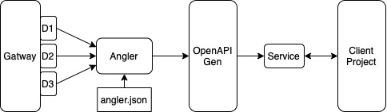

# Angler
Angler is a tool to generate services and models from multiple openapi definitions typically seen in gateways for microservice architectures. It offers automatic detection or manual selection of definitions.

**Without** Angler the generation flow looks like in the image below. The OpenAPI generator has to be run once for each definition file resulting in three output client services.
Each of these services in independent and configured seperatly. Since these are three completly seperate generations, they do not share files resulting in duplicate files among them.
<p align="center">
    
</p>

**With** Angler the generation flow is altered to result in a single client service layer. Before running the OpenAPI generator the definition files are merged.
Angler also autodetect all available definition files. The single service layer has a single a configuration and shares common files.
<p align="center">
    
</p>


## Installation
Angler is a python3 tool which uses the official openapi-generator under the hood, thus python3 ([brew](https://formulae.brew.sh/formula/python@3.9) | [python.org](https://www.python.org/downloads/)) and openapi-generator ([brew](https://formulae.brew.sh/formula/openapi-generator) | [npm](https://openapi-generator.tech/docs/installation/)) have to be installed.

To install angler you may use brew or run it manually
### brew
```
brew tap deitsch/angler
brew install deitsch/tap/angler
```
### manual
Clone repo and add the repo to your path variable to run it globally. Alternatively directly call it via its full path when running it.
```
export PATH="$PATH:/<path to angler>/main.py"
```
## Setup
To start take the [example file](./example.angler.json) and adapt it to your needs. The parameters are explained below. When running angler it searches for a file named `angler.json` in the current directory. You may use `-c <PATH>` to specify a config json file.

| Config      |  |
| ----------- | ----------- |
| generationFolder  | Folder the api will be generated in. Defaults to `./openapi` |
| swaggerUI         | Path to swaggerUI |
| openapi-cli-add   | additional flags added to the openapi generator. Use this for changing fileNaming to kebab-case for example. Defaults to no flags |
| mode              | supported modes are `auto` and `manual`. If unset it defaults to auto |
| generate          | Generate code with the specified OpenAPI generator. If unset do not generate client code and just save the merged definition file. |
| definitions       | Only needed for manual mode, set URL paths which should be considered for generation |

## To be improved
* support set versions in config
    * by default only generate newest version of definition (e.g v1/core & v2/core existing -> use v2). 
        * If some v1 and v2 mixed -> error?
        * just generate newest each?
    * config new `version` option e.g. `v1`
* QoL change: when angler is run and does not detect a config file, ask if one should be created
    * create example with default values
    * create step by step with asking the user for the values
* except definitions for auto mode

## License

Angler is released under the MIT license. See LICENSE for details.
